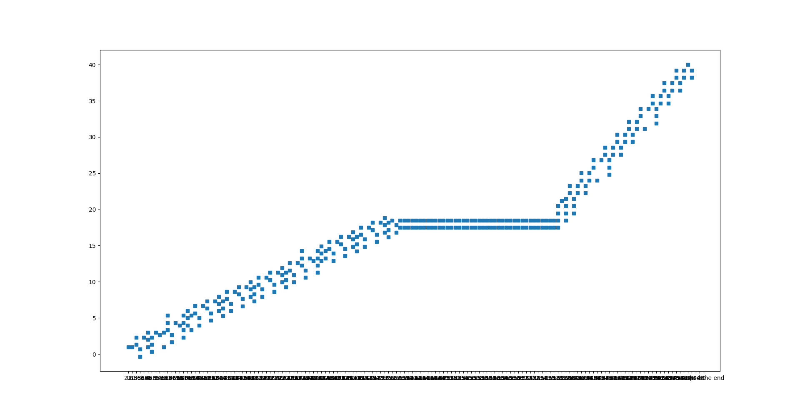

# Problem Statement

Design an Air Traffic Control (ATC) system that automatically routes planes to two runways located near the center.
Planes travel at a constant 140m/s and must not be within 100m of each other. Planes can enter a circular holding
pattern of 1km radius. Planes are spawned randomly at the circumference of a 10km radius circle, and planes must land in
the exact order that they are spawned in.

# Deviations from Original Problem Statement

Due to the ten hour restriction, I couldn't implement some aspects of the problem statement.

1. Runways are modeled as points rather than lines. Because of the short length of the runway, I decided to make the
   runways using a point. Planes would simply route themselves to that point, immediately dissapearing upon reaching the
   runway. Therefore, the "landing of planes"--travelling along the runway from one end to another--as specified in the
   problem statement was not implemented.

2. Planes, upon entering a circular holding pattern, do not check for collisions. I simply increment their timer by the
   amount of time it takes to do one revolution. I chose not to implement this checking because:
    - visual inspection confirmed that the outer edges of the circle have very little contention for airspace.
    - I was nearing the ten hour limit for this problem
    - there were much more interesting problems I'd worked on (see below)

# My Implementation

Upon receiving the problem, I thought for a day about a strategy. This sounded like a pathfinding algorithm, but with
unique constraints. I eventually settled on using the A* pathfinding algorithm.

### Why A*?

A* is widely used for games to route AI while avoiding obstacles. This seemed like a perfect fit for my problem: routing
planes while avoiding other planes.

### Why not A*?

A* unfortunately only deals with a static, two-dimensional, grid-based map. However, the planes in this problem are not
static--they move! Thus, plane paths can intersect, as long as the intersection is done at *two different points in
time*. This point led to my main implementation.

## A* with temporal domain

Instead of doing A* on a two-dimensional grid, as the classic algorithm specifies, I do A* on a three-dimensional grid,
where the third axis is the time axis. Thus, we perform A* on this 3 dimensional grid. This solves the issue of temporal
separation. Since time points are on different grids, paths can intersect as long as they don't intersect at the same
time "plane".

Of course, since computers are digital, the time axis is represented by slices representing an *interval* in time.
Choosing a longer interval means pathfinding will be more conservative, rejecting valid paths (that intersect spatially,
but not temporally). Choosing shorter intervals leads to more pathing options, but takes up much more memory.

This 3d A* algorithm is the crux of my solution. Much of my time was spent debugging A*, as well as problems with doing
3D A*. It was even more difficult because this was my first time implementing A*.

# Design Questions and My Answers

*Should paths be determined ahead-of-time, or should planes decide their paths as they fly along it?*

A just-in-time pathfinding algorithm, where planes just calculate their paths for the next few timesteps, seemed the
most natural for me. This is also matches how ants, and us, navigate. We aim towards the general direction of the
runway, avoiding challenges as they arise.

However, I didn't dare code this strategy. The real-time, non-deterministic behaviour seemed incredibly difficult to get
right and debug. Since pathfinding would be influenced by ephemeral state and positions, I didn't know how I could even
debug errors.

In addition, what would happen if the planes got stuck? There is no turning around or pausing. This last factor made the
just-in-time pathfinding strategy worse the ahead-of-time (AOT) pathfinding.

*What if a plane simply cannot find a path to the runway?*

Even with an AOT algorithm, there is a small chance the plane simply cannot route to the runway. It is caused by the
runway being too full. In addition, there is a strict requirement that planes must land in the order that they spawned
in. Therefore, a plane that is delayed (perhaps, due to taking a longer trip to avoid collisions) will delay all latter
planes that spawn. This cascades delays and will result in general slowdown of the system as time progresses (as we see
later).

In the case where we simply cannot find a path, we simply implement a circular holding pattern of 1km. Therefore, this
translates to a delay of `2 * pi * 1000m / (140 m/s)`  seconds. I did not bother checking for collisions as the plane
goes in a circular holding pattern. There are two reasons why:

1. This only happens when the plane is at the edge of the ATC radius (10km). Once a plane has been "admitted", there is
   a guaranteed collision-free path for it. Since the plane will do its circular holding pattern outside of this radius,
   it is guaranteed to not collide with any planes *inside our ATC radius*. In other words, the holding pattern and the
   ATC circle are tangent, *non-overlapping* circles.

2. If there were collisions, what option did we have? The plane must travel on, but we can't go to the runway nor do a
   circular pattern. Possible alternatives would be a holding pattern with a pathfinding algorithm to avoid collisions (
   thus, a distorted circular shape that avoids planes). However, they seemed too hard to implement within the time
   limit.

# Verification

I wasn't fully confident my answer satisfied all constraints. Therefore, I wrote a verifier in Python to check that the
paths of all planes never intersected at the same time point. After fighting with the C++ beast for a few hours already,
I wasn't down to write more C++. Therefore, I wrote the path information to a CSV, and loaded the CSV using the Pandas
module from Python.

In Python, I looped through every single point, checking that there was never an intersection at the same time.

I also used Python matplotlib to generate all the graphs and GIFs.

# Pictures and Videos

All the points that my A* algorithm searched. There is a wall at y = 20, hence the algorithm finds a way around the
wall. As you can see, A* is not very efficient as it searches way too many points. This is a known problem of A*.

To help debugging, I used colors to separate different time slices. Each color represents pathing at a different time
slice, as the plane travels through the path as well as through time.

  

Some debugging images to test my path avoidance algorithm. Each line represents the planned path for a plane. Colors
represent time. Planes travel from purple to yellow color. As you can see, the pathing algorithm automatically avoids
obstacles.

*note: all pathing here was done within a single time slice, as I wanted to test A*, not the time slice algorithm*. If I
had used multiple time slices for these paths, the planes would cross each other.

The first attempt at spawning planes and getting them to land on runways. Runways are at the center of the image, all
planes travel radially inwards to the runway, avoiding other planes.

An animated GIF of the planes in action. There are very few planes because of a problem mentioned above: spawning planes
cannot arrive at the runway earlier than existing planes. This leads to very inefficient delays.

You can see a version where that restriction is removed here, and spawning earlier does not imply landing earlier.

As you can see, there are much more planes.

# Future Work

Besides the places where I deviated from the original problem statement, there is a lot of future work that could be
done.

1) **Optimization**
   The C++ code runs strangely slow. I suspect there is a lot of optimization that can be done.

2) **Non-greedy algorithms**
   The current algorithm can be considered a greedy algorithm. Planes greedily try to reserve a path for themselves,
   without concerning about later-spawning planes. This is OK, because of the strict ordering requirement mentioned
   above. However, it leads to less-than-optimal throughput. We could possibly optimize for plane throughput by using a
   more global algorithm, instead of just considering each plane one by one.

3) **Memory optimization**
   The current implementation grows memory indefinitely as time progresses. This is because old time slices are not
   recycled. 